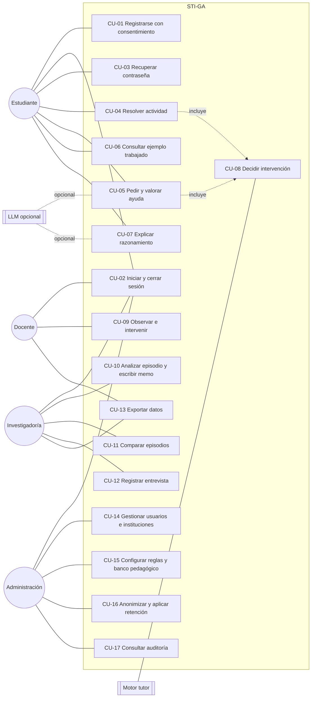
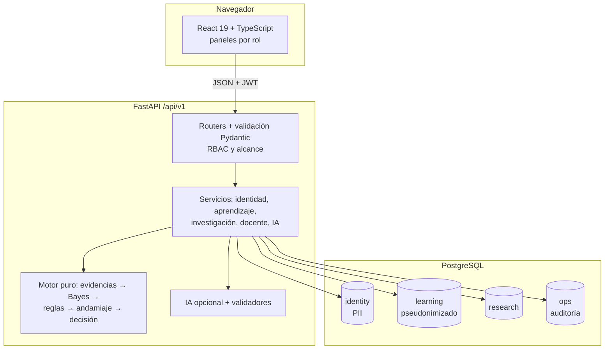
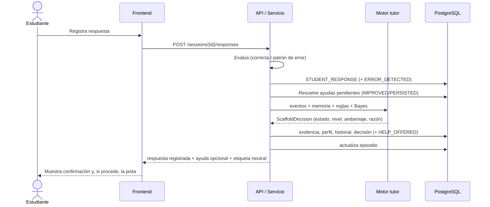
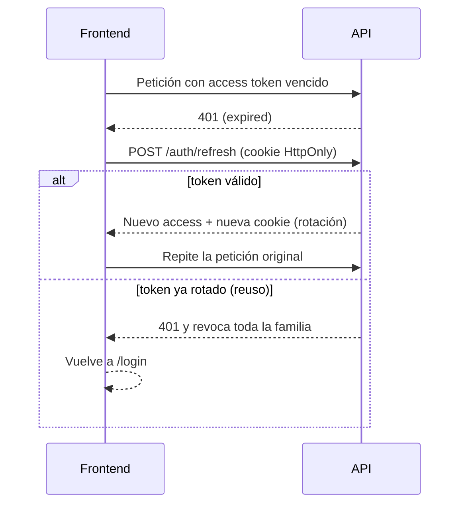
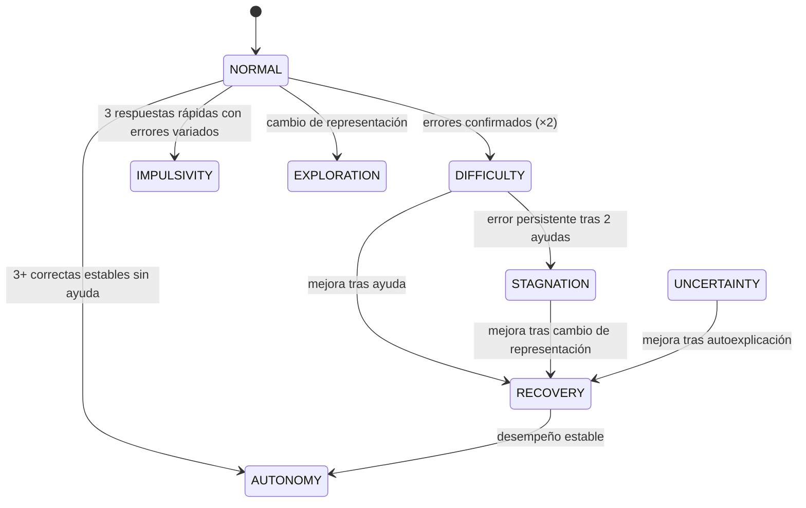
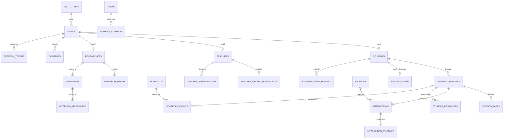

# Documentación del software — STI-GA

**Sistema Tutor Inteligente para la Generalización Algebraica**
Plataforma web de investigación educativa · Versión 0.1.0 · Licencia MIT

| Campo | Valor |
|---|---|
| Destinatarios | Equipo de desarrollo, equipo pedagógico, equipo de investigación, administración institucional |
| Repositorio | `cristianmi24/Sistema-tutor-Algebra` |
| Documentos relacionados | `docs/00`–`docs/13` (arquitectura detallada, API, verificación) |

---

## 1. Introducción

### 1.1 Propósito
Este documento describe el sistema STI-GA: qué hace, quién lo usa, cómo está construido y cómo se opera y extiende. Sirve de referencia única para el desarrollo, la validación pedagógica y el uso del sistema como instrumento de investigación.

### 1.2 Alcance
STI-GA es una plataforma web para estudiantes de 7.º a 9.º grado (12–15 años). Cumple dos funciones inseparables:

1. **Tutor adaptativo.** Acompaña el trabajo en generalización algebraica: observa la interacción, estima el estado del estudiante con varias evidencias, decide con reglas pedagógicas explícitas y ofrece la ayuda mínima necesaria, retirándola cuando hay evidencia de autonomía.
2. **Instrumento de investigación cualitativa.** Registra cada interacción como evento trazable, reconstruye episodios y ofrece herramientas de memos, entrevistas, comparación y exportación, sin imponer categorías teóricas (Teoría Fundamentada Constructivista).

Principio rector: **observar mucho, intervenir poco y adaptar cuando sea necesario.**

### 1.3 Lo que el sistema no es
- No es un chatbot ni un resolutor de tareas: nunca entrega la regla ni el valor pedido.
- No usa aprendizaje profundo ni entrena modelos con datos de estudiantes.
- No convierte registros en conclusiones: una respuesta correcta no se interpreta como comprensión, ni menos ayuda como aprendizaje.
- La IA generativa es opcional y nunca decide la intervención.

### 1.4 Definiciones
| Término | Significado |
|---|---|
| STI | Sistema Tutor Inteligente |
| Andamiaje | Ayuda pedagógica graduada (niveles 1–5) del banco revisado |
| Fading | Retiro progresivo de la ayuda; se registra como evento observable |
| Episodio | Trayectoria reconstruible: dificultad → ayuda → reacción → nueva acción → resultado |
| Evidencia | Señal observable extraída de los eventos recientes (tiempo, errores, intentos, etc.) |
| Estado operativo | Interpretación del sistema (NORMAL, DIFICULTAD…). No es una categoría teórica y nunca se muestra con etiqueta negativa al estudiante |
| Código de participante | Identificador pseudonimizado (`STU-001`) usado en investigación |
| PII | Datos personales identificables |

---

## 2. Descripción general

### 2.1 Actores
| Actor | Tipo | Descripción |
|---|---|---|
| Estudiante | Humano | Resuelve actividades, pide y valora ayudas, explica su razonamiento |
| Docente | Humano | Observa sus grupos, interviene, anota observaciones |
| Investigador/a | Humano | Analiza episodios pseudonimizados, escribe memos, registra entrevistas, exporta |
| Administrador/a | Humano | Gestiona usuarios, instituciones, catálogo pedagógico, reglas y auditoría |
| Acudiente / institución | Humano externo | Otorga consentimiento para menores (registrado en el sistema) |
| Motor tutor | Sistema | Extrae evidencias, infiere, aplica reglas, selecciona andamiajes |
| Proveedor LLM | Sistema externo opcional | Propone reformulaciones e interpretaciones validadas |
| Planificador | Sistema | Ejecuta la retención de datos (tarea programada) |

### 2.2 Supuestos y restricciones
- Navegador moderno; uso en aula con conexión a internet.
- PostgreSQL 16 (local o Supabase).
- El protocolo legal y ético (consentimiento de menores, retención) lo define cada institución; el sistema provee los mecanismos, no la asesoría jurídica.
- Toda autorización se verifica en el backend; el frontend solo adapta la interfaz.

---

## 3. Requisitos

### 3.1 Funcionales (resumen)
| ID | Requisito |
|---|---|
| RF-01 | Registro de estudiantes con datos mínimos, política de privacidad, términos y consentimiento versionados |
| RF-02 | Consentimiento multiparte (estudiante, acudiente, institución) y estado de participación en investigación |
| RF-03 | Inicio de sesión, renovación y cierre de sesión seguros; recuperación de contraseña |
| RF-04 | Control de acceso por rol y por alcance (propio, grupo, institución) |
| RF-05 | Banco de actividades tipos A–G y siete tipos de ejemplos trabajados |
| RF-06 | Resolución con múltiples representaciones: palabras, número, tabla, gráfico, expresión |
| RF-07 | Solicitud, aceptación, rechazo y reformulación de ayuda |
| RF-08 | Perfil dinámico del estudiante con historial |
| RF-09 | Inferencia bayesiana explícita y configurable como apoyo |
| RF-10 | Reglas pedagógicas legibles y versionadas; niveles de intervención 0–5 |
| RF-11 | Selección de andamiaje con memoria (no repetir) y fading registrado |
| RF-12 | Explicación estructurada de cada decisión del tutor |
| RF-13 | Registro append-only de 18 tipos de evento |
| RF-14 | Episodios automáticos y manuales, timeline y comparación sin conclusiones |
| RF-15 | Memos analíticos y entrevistas |
| RF-16 | Exportación CSV, JSON, JSONL, Excel y PDF pseudonimizada y auditada |
| RF-17 | Intervención docente separada de la del sistema |
| RF-18 | IA opcional con validación triple y respaldo |
| RF-19 | Administración de usuarios, instituciones, catálogo y reglas; auditoría |
| RF-20 | Anonimización a petición y retención configurable |

### 3.2 No funcionales
| ID | Categoría | Requisito | Cómo se cumple |
|---|---|---|---|
| RNF-01 | Seguridad | Credenciales y sesiones robustas | Argon2id, JWT 15 min, refresh rotativo con detección de reuso |
| RNF-02 | Privacidad | PII separada de investigación | Esquemas `identity` vs `learning`/`research`; códigos de participante |
| RNF-03 | Trazabilidad | Historia íntegra | Disparadores de BD impiden modificar eventos y auditoría |
| RNF-04 | Explicabilidad | Cada decisión justificada | `ScaffoldDecision` persistida con evidencias, regla y razón |
| RNF-05 | Disponibilidad sin IA | Funcionamiento completo sin LLM | `NullProvider` por defecto |
| RNF-06 | Accesibilidad | WCAG AA | Pruebas con axe-core y de contraste de tokens |
| RNF-07 | Mantenibilidad | Código tipado y probado | TypeScript estricto, mypy estricto, 131 pruebas automatizadas |
| RNF-08 | Rendimiento | Respuesta del tutor en tiempo de aula | Motor puro en memoria; bundle inicial 66 kB |

---

## 4. Casos de uso

### 4.1 Diagrama general



### 4.2 Casos de uso detallados

#### CU-01 · Registrarse con consentimiento
| Campo | Descripción |
|---|---|
| Actor | Estudiante (secundario: acudiente) |
| Precondición | La institución existe, está activa y tiene documentos legales vigentes |
| Disparador | El estudiante elige «Crear cuenta de estudiante» |

**Flujo principal**
1. El estudiante ingresa usuario o correo, contraseña, institución, grado, grupo y, opcionalmente, año de nacimiento.
2. El sistema valida la política de contraseña (≥ 10 caracteres, no común, no solo números).
3. El sistema muestra la política de privacidad vigente; el estudiante confirma haberla leído.
4. El sistema muestra los términos; el estudiante los acepta.
5. El estudiante acepta participar; si la institución exige acudiente, el sistema lo explica y permite indicar la referencia de la autorización.
6. El sistema crea la cuenta, asigna el código `STU-nnn` y registra cada consentimiento con versión, fecha y evidencia.
7. El sistema calcula el estado de participación: `ELIGIBLE` si están todas las partes requeridas; si no, `PENDING`.

**Flujos alternativos**
- 2a. Contraseña débil → mensaje y no avanza.
- 6a. Identificador ya registrado → error 409.
- 6b. Versión legal desactualizada → error `CONSENT_VERSION_MISMATCH`.
- 7a. Falta el acudiente → cuenta `PENDING_CONSENT`: puede trabajar, pero sus datos no entran a investigación. El acudiente o la institución pueden registrar el consentimiento después (`POST /consents`).

**Postcondición:** cuenta creada; auditoría `USER_CREATED` y `CONSENT_RECORDED`.

#### CU-02 · Iniciar y cerrar sesión
| Campo | Descripción |
|---|---|
| Actor | Cualquier usuario |
| Precondición | Cuenta activa o pendiente de consentimiento |

**Flujo principal:** el usuario envía credenciales → el sistema verifica con Argon2id → emite token de acceso (15 min) y cookie HttpOnly de refresco → redirige al panel de su rol. Al expirar el token, el frontend renueva en silencio; al cerrar sesión se revoca la familia de tokens.

**Alternativos:** credenciales inválidas → mensaje único (no revela si la cuenta existe); 5 fallos → bloqueo temporal (423); reuso de un token ya rotado → se revoca toda la sesión (posible robo); demasiados intentos → 429.

#### CU-03 · Recuperar contraseña
**Actor:** usuario con correo. **Flujo:** solicita recuperación → el sistema responde igual exista o no la cuenta → si existe, genera token aleatorio (se guarda solo su hash, vence en 30 min) y envía enlace → el usuario define nueva contraseña → el token se invalida y se cierran todas sus sesiones. **Alternativo:** token vencido o usado → error y nueva solicitud.

#### CU-04 · Resolver actividad
| Campo | Descripción |
|---|---|
| Actor | Estudiante (sistema: motor tutor) |
| Precondición | Sesión autenticada; sesión de trabajo activa |

**Flujo principal**
1. El estudiante inicia una sesión de trabajo; el sistema asigna las actividades de su grado (`SESSION_STARTED`).
2. Abre una actividad (`TASK_OPENED`); ve el enunciado y el patrón (numérico o figural).
3. Elige una pregunta y una representación (`REPRESENTATION_CHANGED` si cambia).
4. Registra su respuesta. El sistema la evalúa en privado (corrección, patrón de error o dimensiones del lenguaje) y registra `STUDENT_RESPONSE`, `STUDENT_REATTEMPT` o `STUDENT_EDITED_RESPONSE`; si no coincide con la regla, también `ERROR_DETECTED`.
5. Se ejecuta **CU-08**; si hay ayuda, se muestra en el panel de ayuda.
6. El estudiante ve «Tu respuesta quedó registrada» y una etiqueta neutral de estado (p. ej., «En marcha»).
7. Al terminar marca «Terminé esta actividad» (`TASK_COMPLETED`) y, al final, cierra la sesión (`SESSION_ENDED`).

**Alternativos:** respuesta vacía → aviso sin registro; sesión cerrada → solo lectura; ya hay una sesión activa → se ofrece continuarla.

**Regla clave:** el estudiante **nunca** ve si acertó ni el patrón de error (aprendizaje > corrección inmediata).

#### CU-05 · Pedir y valorar ayuda
**Actor:** estudiante. **Flujo principal:** pulsa «Pedir una pista» (`HELP_REQUESTED`) → CU-08 selecciona la ayuda de menor explicitud útil (`HELP_OFFERED`) → el estudiante elige «Me sirve» (`HELP_ACCEPTED`), «No, gracias» (`HELP_REJECTED`) o «Dímelo de otra forma» (`HELP_REFORMULATED`). **Alternativos:** reformulación por IA rechazada por los validadores → se usa una variante del banco; banco agotado → mensaje y sugerencia de acompañamiento docente. **Postcondición:** la memoria de intervención registra el resultado (`IMPROVED`, `PERSISTED`, `REJECTED`) cuando llega la siguiente respuesta.

#### CU-06 · Consultar ejemplo trabajado
El estudiante abre un ejemplo (`EXAMPLE_OPENED`): resuelto, parcial, con pasos ocultos que se revelan tras anticipar, autoexplicación, comparación de estrategias, error intencional o transferencia. Los ejemplos usan un patrón distinto al de la tarea para no resolverla.

#### CU-07 · Explicar razonamiento
El estudiante escribe su explicación (`SELF_EXPLANATION`). Si la IA está activa, se genera una interpretación con vocabulario cerrado, validada y visible solo para el personal.

#### CU-08 · Decidir intervención (caso del sistema)
| Campo | Descripción |
|---|---|
| Actor | Motor tutor |
| Disparador | Respuesta registrada o solicitud de ayuda |

**Flujo principal (OBSERVAR → INTERPRETAR → DECIDIR → ADAPTAR → RECORDAR)**
1. **Observar:** se extraen evidencias de los últimos 5 eventos de la tarea.
2. **Interpretar:** la inferencia bayesiana calcula P(estado | evidencias).
3. **Decidir:** las reglas se evalúan por prioridad; la primera que se cumple fija estado, nivel y tipo de intervención.
4. **Restricciones:** pausa tras intervención docente; tope de 4 intervenciones automáticas por tarea.
5. **Adaptar:** se elige la ayuda menos explícita compatible, excluyendo las ya ofrecidas o rechazadas.
6. **Recordar:** se guardan evidencia, perfil, historial y decisión explicable.

**Alternativos:** ninguna regla se cumple → nivel 0 (observar); regla con confirmación pendiente → se observa hasta la segunda evaluación; mejora tras ayuda → fading registrado sin nueva ayuda.

#### CU-09 · Observar e intervenir (docente)
**Flujo:** el docente ve sus grupos (actividad actual, etiqueta neutral y estado operativo, ayudas, sugerencia de acompañamiento) → abre la sesión y ve la trayectoria → escribe una pregunta, comentario, reorientación o ánimo → el sistema la guarda como intervención docente y crea el evento `TEACHER_INTERVENTION` (nunca `HELP_OFFERED`) → el tutor automático pausa → el estudiante ve el mensaje en violeta, rotulado «Tu docente te escribe». **Alternativo:** observación «solo para investigación» → no la ve el estudiante ni genera evento. **Restricción:** solo sus grupos (fuera de alcance → 404).

#### CU-10 · Analizar episodio y escribir memo
**Actor:** investigador/a. **Flujo:** consulta participantes (solo códigos) → abre un episodio → revisa contexto, resumen descriptivo y timeline por fases con actor explícito, la interpretación operativa del sistema y la razón de cada ayuda → escribe un memo con observación, interpretación, pregunta emergente, contradicción, caso negativo, posible categoría y necesidad de muestreo teórico. **Alternativo:** crear un episodio manual a partir de un rango de eventos. **Regla:** las categorías del investigador se guardan separadas de las clasificaciones del sistema.

#### CU-11 · Comparar episodios
Selecciona Episodio A y B → el sistema muestra lado a lado contexto, estrategia registrada, representaciones, ayudas, reacciones, intervención docente, trayectoria y cierre, con la nota «el sistema no produce conclusiones».

#### CU-12 · Registrar entrevista
Asocia la entrevista a un estudiante (código) o docente, y opcionalmente a sesión, tarea o episodio; registra preguntas, respuestas y observaciones; puede añadir respuestas después.

#### CU-13 · Exportar datos
Elige conjunto (participantes, sesiones, interacciones, episodios, decisiones, historial del perfil, memos, entrevistas) y formato → el sistema filtra por alcance, pseudonimiza, protege contra inyección de fórmulas en Excel y audita `EXPORT_GENERATED`. El docente solo exporta sesiones, interacciones y episodios de sus grupos.

#### CU-14 · Gestionar usuarios e instituciones
Crear docentes (con grupos), investigadores y administradores; deshabilitar o reactivar cuentas; crear instituciones con política de consentimiento y retención. El listado de usuarios queda auditado como acceso a PII.

#### CU-15 · Configurar reglas y banco pedagógico
Ver reglas SI/ENTONCES, activarlas o desactivarlas (versionado y auditado); crear versiones de la configuración bayesiana; gestionar actividades, ejemplos y andamiajes. Simular una decisión con evidencias dadas (`POST /scaffolding/decision`).

#### CU-16 · Anonimizar y aplicar retención
**Anonimizar:** a petición del titular, la administración elimina correo, usuario, año de nacimiento y credenciales; la cuenta queda deshabilitada y los datos de investigación permanecen con el código. **Retención:** tarea programada (`python -m app.cli retention`) que anonimiza cuentas inactivas más allá de los días fijados por la institución; admite simulación (`--dry-run`).

#### CU-17 · Consultar auditoría
Filtrar por acción, actor y fechas: inicios de sesión, fallos, bloqueos, reuso de tokens, consentimientos, exportaciones, cambios de reglas y accesos a PII.

---

## 5. Arquitectura

### 5.1 Arquitectura clásica de un STI aplicada
| Componente clásico | Implementación en STI-GA |
|---|---|
| Modelo del dominio | Actividades con regla privada, evaluador determinista de expresiones en `n` y patrones de error (`learning/evaluation.py`) |
| Modelo del estudiante | Evidencias multiseñal + perfil dinámico con historial (`tutor/evidence.py`, `student_state`) |
| Modelo pedagógico | Inferencia bayesiana auxiliar + reglas legibles + selección de andamiaje + fading (`tutor/`) |
| Interfaz | Pantalla de actividad con representaciones, ejemplos, ayuda y explicación (`frontend/src/features/student`) |

### 5.2 Vista de componentes



Decisiones principales: monolito modular (una transacción cubre evento, estado y decisión), motor sin acceso a datos (determinista y probable), eventos append-only, autenticación propia en lugar de Supabase Auth (consentimiento de menores y alcance fino). Registro completo en `docs/11-decisiones-adr.md`.

### 5.3 Secuencia: respuesta del estudiante y decisión del tutor



### 5.4 Secuencia: renovación de sesión



---

## 6. Modelo pedagógico adaptativo

### 6.1 Estados operativos
| Estado | Lectura operativa | Etiqueta que ve el estudiante |
|---|---|---|
| NORMAL | Trabajo estable | En marcha |
| EXPLORATION | Cambia de representación sin error persistente | Explorando |
| DIFFICULTY | Errores con intentos genuinos | Pensando |
| UNCERTAINTY | Muchos cambios de respuesta, tiempos largos | Revisando |
| IMPULSIVITY | Respuestas muy rápidas con errores variados | Rápido |
| STAGNATION | Mismo error persistente tras ayudas | Buscando otro camino |
| RECOVERY | Mejora tras una ayuda | Avanzando |
| AUTONOMY | Buen desempeño estable sin ayuda | Con autonomía |



### 6.2 Evidencias
Tiempo relativo al esperado (rápido/típico/lento) y racha rápida · precisión reciente · intentos · repeticiones de la misma respuesta · patrón de clics · patrón de error (ninguno/variado/persistente) · cambios de respuesta · solicitudes de ayuda · resultado de la ayuda anterior · cambios de representación · tendencia de errores · racha correcta · intervención docente reciente. **Ninguna señal aislada decide**; el tiempo largo por sí solo nunca dispara ayuda.

### 6.3 Inferencia bayesiana
Naive Bayes discreto: `P(S | e) ∝ P(S) · Π P(eᵢ | S)`, con suavizado. Priors y verosimilitudes son configuración humana versionada (`learning.bayesian_config`); no hay entrenamiento. El resultado solo alimenta condiciones de reglas (p. ej., `P(STAGNATION) > 0.45`) y la «necesidad de apoyo».

### 6.4 Reglas vigentes (prioridad descendente)
| Código | Condición resumida | Acción |
|---|---|---|
| R-TEACHER-PAUSE | Intervención docente reciente y sin solicitud | Nivel 0 |
| R-HELP-REQUESTED | Pide ayuda y no hay ayuda fallida previa | Orientación (nivel 2) |
| R-HELP-REQUESTED-AGAIN | Pide ayuda y la anterior no funcionó | Pista (nivel 3) |
| R-STAGNATION-RECOVERY | Error persistente, 5+ intentos, 3+ ayudas sin mejora, P alta | Recuperación (nivel 5) |
| R-STAGNATION-REPR | Error persistente, 4+ intentos, 2+ ayudas sin mejora, P alta | Cambio de representación (nivel 4) |
| R-DIFFICULTY-ORIENT | Precisión baja tras microayuda sin mejora | Orientación (nivel 2) |
| R-IMPULSIVITY-META | 3 respuestas rápidas con errores variados o clics erráticos | Metacognición (nivel 1) |
| R-UNCERTAINTY-SELFEXPL | 3+ cambios de respuesta, P(incertidumbre) alta | Autoexplicación (nivel 2) |
| R-DIFFICULTY-MICRO | Precisión baja, 2+ intentos, confirmada en 2 evaluaciones | Microayuda (nivel 1) |
| R-RECOVERY-FADE | Mejora tras ayuda, sin nueva solicitud | Reducir apoyo |
| R-AUTONOMY-ZERO | Precisión alta estable sin ayuda | Nivel 0, reducir |
| R-EXPLORATION | Cambió de representación sin error persistente | Nivel 0 |

### 6.5 Niveles y banco de andamiajes
| Nivel | Nombre | Tipos |
|---|---|---|
| 0 | Observar | — |
| 1 | Microayuda | Focalización, metacognición |
| 2 | Orientación | Pregunta orientadora, autoexplicación |
| 3 | Andamiaje | Pista estructural, división de tarea, reflexión sobre el error |
| 4 | Cambio de representación | Tabla, gráfico, comparación de estrategias |
| 5 | Recuperación | Reconstruir desde un ejemplo parcial (nunca la respuesta) |

Ejemplo (C.39): ante «en cada figura se agregan 3», el sistema no responde «3n + 2»; pregunta «¿Cómo podrías relacionar el número de la figura con la cantidad total?» y luego «¿Funciona para una figura que todavía no aparece?».

### 6.6 Explicación de cada decisión
Cada ayuda guarda `need_detected`, evidencias, andamiajes candidatos y elegido, nivel, confianza, razón, regla, reglas que coincidieron, estado previo e inferido, posterior bayesiano, nivel previo, acción de fading, restricciones aplicadas y si se sugiere al docente.

---

## 7. IA opcional
| Puede | No puede |
|---|---|
| Reformular una ayuda ya aprobada («dímelo de otra forma») | Decidir si intervenir, cuándo o con qué nivel |
| Etiquetar una explicación con un vocabulario cerrado de dimensiones observables | Dar la regla, la fórmula o valores pedidos |
| | Evaluar al estudiante o proponer categorías teóricas |
| | Recibir datos personales |

Cadena: LLM → validador pedagógico → validador de seguridad → validador de dominio → aprobar o usar el banco. Cada llamada queda en `ai_interactions` con prompt, salida, validación y latencia. Proveedor: SDK oficial de Anthropic (modelo por defecto `claude-opus-5`, salida estructurada, esfuerzo bajo, respaldo ante rechazos). Límite de llamadas por sesión. Desactivada por defecto.

---

## 8. Modelo de datos



| Esquema | Tablas | PII |
|---|---|---|
| `identity` | institutions, users, students, teachers, researchers, teacher_group_assignments, legal_documents, consents, refresh_tokens, password_reset_tokens | Sí |
| `learning` | tasks, worked_examples, learning_sessions, session_tasks, student_responses, interactions, interaction_evidence, student_state, student_state_history, scaffolds, scaffold_events, tutor_rules, bayesian_config, ai_interactions, teacher_interventions | No |
| `research` | episodes, episode_interactions, research_memos, interviews, interview_responses | No |
| `ops` | audit_logs, system_settings | Solo el id del actor |

La representación de cada respuesta se guarda en `student_responses` e `interactions` (no hay tabla `representations` aparte). Migraciones Alembic 0001–0006.

### 8.1 Evento de trazabilidad (C.19)
`session_id, student_id, task_id, timestamp, sequence, event_type, student_action, student_response, representation, help_requested, help_level, help_type, help_content, help_accepted, help_rejected, ai_interpretation, teacher_intervention, next_student_action, client_meta` (tiempo en tarea, clics, ediciones).

Tipos: SESSION_STARTED, TASK_OPENED, EXAMPLE_OPENED, STUDENT_RESPONSE, STUDENT_EDITED_RESPONSE, HELP_REQUESTED, HELP_OFFERED, HELP_ACCEPTED, HELP_REJECTED, HELP_REFORMULATED, STUDENT_REATTEMPT, REPRESENTATION_CHANGED, SELF_EXPLANATION, ERROR_DETECTED, TEACHER_INTERVENTION, TASK_COMPLETED, TASK_ABANDONED, SESSION_ENDED.

---

## 9. Interfaz de programación
API REST en `/api/v1`, documentada automáticamente en `/docs`. Grupos: salud y metadatos, autenticación y consentimiento, actividades y sesiones, motor adaptativo, investigación, docente, IA, administración. Tabla completa de rutas, roles y códigos de error en `docs/08-api.md`.

## 10. Interfaz de usuario
| Rol | Pantallas |
|---|---|
| Estudiante | Inicio, sesión de trabajo, actividad (tarea · resolución · representaciones · ejemplo · ayuda · explicar razonamiento), progreso |
| Docente | Grupos, observación de sesión con intervención, episodios, exportación |
| Investigador/a | Participantes, sesiones con trayectoria, episodios, detalle con memos, comparación, memos, entrevistas, exportación, trazas de IA |
| Administración | Panel, usuarios, instituciones, catálogo, reglas e inferencia, IA, auditoría |

Diseño: tipografía única Lexend (autoalojada), paleta con roles semánticos, azul para el sistema y violeta para el docente, estados siempre con icono y texto, modo oscuro, diseño adaptable a móvil.

---

## 11. Seguridad y privacidad
- **Autenticación:** Argon2id; JWT de 15 min con verificación de firma, emisor, audiencia y expiración; refresco opaco rotativo en cookie HttpOnly `SameSite=Strict`; reuso ⇒ revocación de la familia.
- **Autorización:** rol + alcance en cada ruta; fuera de alcance responde 404 para no revelar existencia.
- **Abuso:** límite de intentos, bloqueo progresivo, límite de 1 MB por petición, límite de llamadas a IA.
- **Integridad:** disparadores de BD impiden modificar o borrar eventos, historial del perfil y auditoría.
- **Privacidad:** minimización de datos; PII separada; códigos de participante; exportaciones pseudonimizadas; anonimización y retención.
- **Menores:** consentimiento multiparte y exclusión de investigación hasta el consentimiento efectivo; el clic del estudiante no se asume como consentimiento legal suficiente.
- **Web:** CORS por lista, cabeceras de seguridad, CSP, errores sin trazas, sin secretos en el frontend (verificado en el build).

Marco de referencia en Colombia: Ley 1581 de 2012 y protocolo ético institucional. Este documento no es asesoría jurídica.

---

## 12. Pruebas y calidad

| Nivel | Herramienta | Cantidad |
|---|---|---|
| Backend: unitarias e integración | pytest + PostgreSQL | 100 |
| Frontend: componentes, páginas, cliente, accesibilidad, contraste | Vitest + Testing Library + axe-core | 31 |
| Extremo a extremo | Chromium real (`npm run e2e`) | 1 flujo completo, 4 roles |
| Estático | ruff, mypy estricto, tsc estricto, eslint | — |

### 12.1 Trazabilidad casos de prueba C.43 → pruebas
| Caso | Prueba |
|---|---|
| 1 Buen desempeño → no intervención | `test_tutor_engine.py::test_case_1_…` |
| 2 Error aislado → observar | `test_case_2_…` |
| 3 Errores persistentes → microayuda | `test_case_3_…` |
| 4 Persistencia → orientación | `test_case_4_…` |
| 5 Estancamiento → cambio de representación | `test_case_5_…`, `test_stagnation_…` |
| 6 Mejora → reducción de ayuda | `test_case_6_…` + integración |
| 7 Autonomía → retirada | `test_case_7_…` |
| 8 Ayuda rechazada → no repetir | `test_case_8_…`, `test_help_request_…` |
| 9 Intervención docente separada | `test_teacher.py` |
| 10 LLM inválido → bloquear | `test_ai.py::test_case_10_…` |
| 11 Sin permisos → rechazar | `test_auth.py`, `test_security.py` |
| 12 Token expirado → renovar | `test_auth.py`, `client.test.ts` |

Detalle y hallazgos corregidos en `docs/13-fases-2-8-verificacion.md`.

---

## 13. Instalación y operación

### 13.1 Requisitos
Python 3.11+, `uv`, Node 20.19+, PostgreSQL 16 (Docker o Supabase).

### 13.2 Puesta en marcha
```bash
docker compose up -d postgres
cd backend && cp .env.example .env
uv venv && uv pip install -e ".[dev]"
.venv/bin/alembic upgrade head
.venv/bin/python -m app.cli seed-demo
.venv/bin/uvicorn app.main:app --port 8000        # API y /docs
cd ../frontend && cp .env.example .env && npm ci && npm run dev   # http://localhost:5173
```
Cuentas de demostración (contraseña `Demo-STI-GA-2026!`): `admin@demo.edu`, `docente@demo.edu`, `investigadora@demo.edu`, `estudiante1..3`.

### 13.3 Variables de entorno principales
| Variable | Uso |
|---|---|
| `DATABASE_URL` / `ALEMBIC_DATABASE_URL` | Conexión (driver `postgresql+psycopg`) |
| `DATABASE_USES_TRANSACTION_POOLER` | `true` con el pooler de Supabase |
| `JWT_SECRET_KEY` | Secreto ≥ 32 caracteres (obligatorio en producción) |
| `CORS_ORIGINS`, `FRONTEND_BASE_URL` | Orígenes permitidos y enlaces de recuperación |
| `RATE_LIMIT_AUTH`, `LOGIN_MAX_FAILED_ATTEMPTS` | Protección contra abuso |
| `TUTOR_WINDOW_SIZE`, `TUTOR_MAX_INTERVENTIONS_PER_TASK` | Parámetros del tutor |
| `LLM_ENABLED`, `LLM_PROVIDER`, `LLM_MODEL`, `LLM_API_KEY` | IA opcional |

En producción la configuración rechaza valores inseguros (DEBUG activo, secreto por defecto, orígenes `http://`).

### 13.4 Operación
- Retención: `python -m app.cli retention --dry-run` y luego sin `--dry-run` (programar con cron).
- Integración continua: `.github/workflows/ci.yml` (lint, tipos, migraciones, pruebas).
- Verificación completa: `make check`; extremo a extremo: `make e2e`.

---

## 14. Mantenimiento y extensión
| Necesidad | Dónde |
|---|---|
| Nueva actividad o ejemplo | `/admin/catalog` o `POST /catalog/tasks`; semilla en `backend/app/seed/catalog.py` |
| Nuevo andamiaje | `POST /catalog/scaffolds` (texto, variantes, nivel, tipos de tarea) |
| Nueva regla pedagógica | `POST /tutor-rules` con el DSL `when`/`then` (ver `docs/05`); probar antes con la simulación |
| Ajustar Bayes | `POST /bayesian-config` crea una nueva versión |
| Nuevo tipo de evento | `modules/common/enums.py` + migración del `CHECK` + fase del timeline |
| Nuevo módulo | Modelos en `modules/<x>/models.py`, registro en `app/models.py`, router en `api/v1/__init__.py`, migración Alembic |

Convenciones: una migración por cambio de esquema con `downgrade`; motor sin acceso a BD; toda ruta declara su rol; pruebas por módulo.

---

## 15. Limitaciones y trabajo futuro
- Envío real de correo (SMTP) pendiente; hoy el enlace de recuperación queda en el log.
- Las reglas y probabilidades son una propuesta inicial: requieren validación del equipo pedagógico y ajuste con un piloto.
- La verificación de identidad del acudiente depende del protocolo institucional.
- El proveedor de IA real necesita clave y un piloto que demuestre utilidad (criterio en `docs/06`).
- Posibles ampliaciones: más dominios matemáticos, editor visual de reglas, tablero agregado por grupo, prueba de extremo a extremo en CI.

---

## 16. Glosario breve
**Generalización algebraica:** construir y justificar una regla que vale para cualquier caso de un patrón. **Relación recursiva:** de un término al siguiente («suma 3»). **Relación funcional:** de la posición al término («3n + 2»). **Transferencia:** reutilizar una relación en una situación nueva. **Memo:** registro analítico del investigador. **Muestreo teórico:** buscar nuevos casos para desarrollar categorías emergentes.
